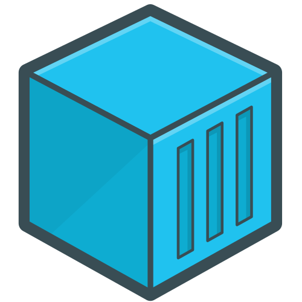
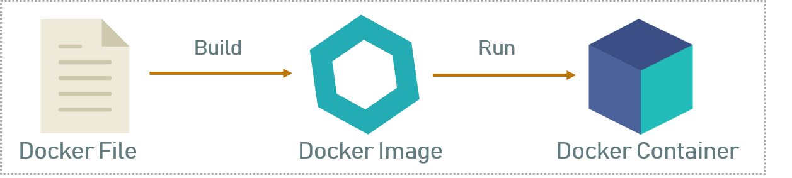

# Docker Intro

## What is a container?

Containers are a packaging mechanism in which applications are abstracted from the enviroment on which they run.

Containers were created to solve 4 main problems in software deployment:

### 1. Standardization

Dependencies for an application might update and break it. Containers solve this problem by having a stable environment, all the dependencies are specified in the container's configuration alongside their versions to ensure the app will run as stable as it can in a standard environment.

### 2. Portability

Containers are also very portable, configurations file being small in size its very easy to version control them and create from scratch or download the necessities of the container on any machine regarding environment.

### 3. Lightweight

Containers use the host's OS kernel, making them very efficient to run.

### 4. Security

A container runs as a new environment so access in a container will give limited access as opposed to access on the host machine.

## Bare Metal vs Virtual Machines vs Containers 

### Bare metal

In some cases bare metal is used because of a small increase in performance or latency or for licencing. But it's incredibly restricted and requires mental gymnastics to maintain it.

### Virtual Machines

Virtual Machines spin up a new OS that runs on top of the host's OS. This is a hard, resouce heavy operation that can take up minutes just to start up and use more memory since now the aplications running in the VM will now use another kernel that talks to the hypervisor and requires hardware level virtualization.
An advantage of VMs over containers is that VMs ofer a better level of security because the applications run on the independent kernel.

### Containers

As mentiond before, containers are lightweight since they use the native kernel, starting up in milliseconds and require less memory, offering close to native performace. They use OS level virtualization and dont require hardware virtualization technology.

***

## What is Docker?

In many ways Docker caries the kleenex effect when talking about containers. Docker came out in 2013 as a monolith and then moved away to use containerd and runc for its core container operations. 

### From Dockerfiles to Docker Container

* Dockerfiles are configuration documents with commands regarding the architecture of a docker image.

* Docker images are made up of layers in order to increase reusability. If a new version of a image needs to be rebuit/downloaded, only the layers that are changed will be affected, the rest will remain intact saving on build time or download time and resources.

* Docker containers are instances of Docker images
